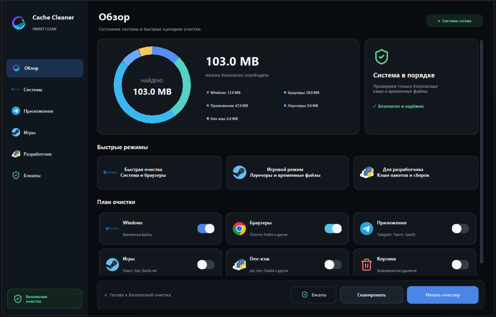
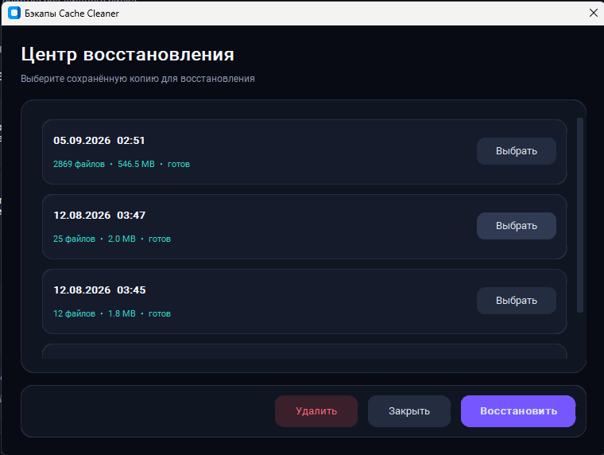

<div align="center">
  

  # Cache Cleaner

  **A modern Windows utility for scanning and safely removing temporary files and application caches.**

  [](https://www.microsoft.com/windows)
  [](https://www.python.org/)
  [](LICENSE)

  [English](README.md) · [Русский](README_RU.md) · [Download EXE](https://github.com/sweetenerbae/cache-cleaner/raw/refs/heads/main/dist/cache_clear.exe)
</div>

---

## Preview

### Main dashboard



<details>
  <summary><strong>More screenshots</strong></summary>
  <br>

  **Backup and recovery center**

  

  **Cleanup result**

  
</details>

## Features

- Scan selected locations before deleting anything
- Live donut chart grouped by category and refreshed after cleanup
- Clean Windows temporary files
- Clean Adobe, Discord, Telegram, Teams, Spotify, browser, and game-launcher caches
- Optional developer mode for pip, npm, pnpm, Yarn, Gradle, and NuGet caches
- Scan and empty the Windows Recycle Bin with a separate confirmation
- Support Chrome, Firefox, Edge, Brave, and Yandex Browser
- Official brand icons embedded into the application
- Create compressed ZIP backups and verify their integrity before cleanup
- Restore a backup or select and delete several old backups at once
- Optional automatic deletion of backups older than 7, 30, or 90 days
- Remind the user when old backups continue to occupy disk space
- Show the exact cleaned and remaining size
- Report files that Windows or running applications have locked
- Graphite liquid-glass interface with sidebar navigation and large application icons
- Quick cleanup presets for everyday, gaming, and developer scenarios
- Responsive layout with a compact sidebar and scrolling on smaller windows

## Quick start

1. [Download `cache_clear.exe`](https://github.com/sweetenerbae/cache-cleaner/raw/refs/heads/main/dist/cache_clear.exe).
2. Run the downloaded file.
3. Accept the Windows administrator prompt.
4. Select the categories and click **Scan** or **Start cleanup**.

Python is not required for the ready-to-use EXE. Windows SmartScreen may display a warning because the executable is not code-signed.

> Close browsers and selected applications before cleaning. Files currently used by Windows or another application are safely skipped.

## What is cleaned

| Category | Locations |
|---|---|
| Windows | User temporary files, `Windows\Temp`, Prefetch |
| Adobe | Media Cache, Media Cache Files, selected custom cache folder |
| Discord | Cache, Code Cache, GPUCache |
| Applications | Telegram media cache, Microsoft Teams cache, Spotify UI and media cache |
| Browsers | Chrome, Firefox, Edge, Brave, Yandex Browser caches |
| Game launchers | Steam web/UI cache, Epic Games Launcher web cache, Battle.net cache |
| Developer mode | pip, npm, pnpm, Yarn, Gradle, NuGet dependency caches |
| Recycle Bin | Contents of the Windows Recycle Bin; disabled by default and not included in backups |

Game installations, source code, `node_modules`, virtual environments, and project build folders are not selected. Developer caches may need to be downloaded again on the next build.

The Recycle Bin and game-launcher cleanup options are disabled by default. Developer cache choices are inactive until **Developer mode** is enabled. Recycle Bin contents cannot be included in a ZIP backup and are removed only after a separate confirmation.

## Backups and privacy

When backup protection is enabled, Cache Cleaner creates a compressed ZIP archive before deletion and verifies that its entries use ZIP compression. Backups are stored locally in:

```text
%LOCALAPPDATA%\CacheCleaner\backups
```

Runtime logs and backup files are excluded from Git. They are not uploaded to this repository by normal commits.

The backup center displays the original and compressed sizes. It supports restoring one backup, selecting multiple backups for quick deletion, and automatically removing copies older than 7, 30, or 90 days. Automatic deletion is disabled by default. Cache Cleaner reminds you after cleanup when a newly created backup is still taking up disk space.

Cache Cleaner does not collect telemetry or upload scanned paths, logs, or backups. All scanning, cleanup, and recovery operations run locally.

## Run from source

```bat
git clone https://github.com/sweetenerbae/cache-cleaner.git
cd cache-cleaner
py -m venv venv
venv\Scripts\activate
pip install -r requirements.txt
python main.py
```

## Build the EXE

Run the safe build script:

```bat
build_exe.bat
```

It builds the application separately, waits if Cache Cleaner is still running, and then places the result in `dist\cache_clear.exe`.

## Project structure

```text
main.py              Application entry point
gui_builder_v2.py    Sidebar interface, presets, and donut dashboard
gui_builder.py       Previous interface kept for reference
cleanup_logic.py     Scanning and cleanup logic
backup_system.py     Backup creation and restoration
restore_window.py    Backup manager interface
utils.py             Windows paths and shared data models
assets/brand-icons   Embedded application and browser icons
```

## Author

Created by [sweetenerbae](https://github.com/sweetenerbae).

## License

Distributed under the [MIT License](LICENSE).

Third-party brand and interface icon notices are listed in [THIRD_PARTY_NOTICES.md](THIRD_PARTY_NOTICES.md).
