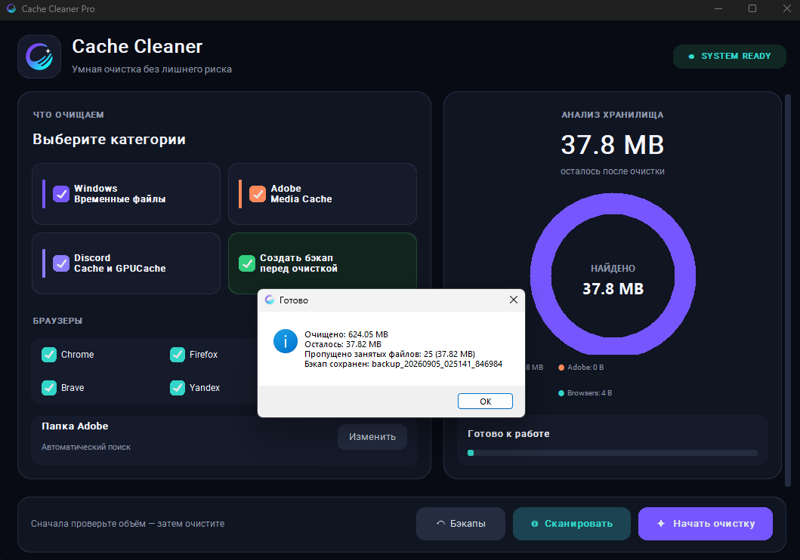

<div align="center">
  

  # Cache Cleaner

  **A modern Windows utility for scanning and safely removing temporary files and application caches.**

  [](https://www.microsoft.com/windows)
  [](https://www.python.org/)

  [English](README.md) · [Русский](README_RU.md) · [Download EXE](https://github.com/sweetenerbae/cache-cleaner/raw/refs/heads/main/dist/cache_clear.exe)
</div>

---

## Preview



## Features

- Scan cache before deleting anything
- Live donut chart grouped by cache category
- Clean Windows temporary files
- Clean Adobe, Discord, and browser caches
- Support Chrome, Firefox, Edge, Brave, and Yandex Browser
- Create ZIP backups before cleanup and restore them later
- Show the exact cleaned and remaining size
- Report files that Windows or running applications have locked
- Responsive dark interface

## Quick start

1. [Download `cache_clear.exe`](https://github.com/sweetenerbae/cache-cleaner/raw/refs/heads/main/dist/cache_clear.exe).
2. Run the downloaded file.
3. Accept the Windows administrator prompt.
4. Select the categories and click **Scan** or **Start cleanup**.

Python is not required for the ready-to-use EXE. Windows SmartScreen may display a warning because the executable is not code-signed.

> Close browsers, Discord, and Adobe applications before cleaning. Files currently used by Windows or another application are safely skipped.

## What is cleaned

| Category | Locations |
|---|---|
| Windows | User temporary files, `Windows\Temp`, Prefetch |
| Adobe | Media Cache, Media Cache Files, selected custom cache folder |
| Discord | Cache, Code Cache, GPUCache |
| Browsers | Chrome, Firefox, Edge, Brave, Yandex Browser caches |

## Backups and privacy

When backup protection is enabled, Cache Cleaner creates a ZIP archive before deletion. Backups are stored locally in:

```text
%LOCALAPPDATA%\CacheCleaner\backups
```

Runtime logs and backup files are excluded from Git. They are not uploaded to this repository by normal commits.

## Run from source

```bat
git clone https://github.com/sweetenerbae/cache-cleaner.git
cd cache-cleaner
py -m venv venv
venv\Scripts\activate
pip install -r requirements.txt
python main.py
```

## Build the EXE

Run the safe build script:

```bat
build_exe.bat
```

It builds the application separately, waits if Cache Cleaner is still running, and then places the result in `dist\cache_clear.exe`.

## Project structure

```text
main.py              Application entry point
gui_builder.py       Main interface and donut chart
cleanup_logic.py     Scanning and cleanup logic
backup_system.py     Backup creation and restoration
restore_window.py    Backup manager interface
utils.py             Windows paths and shared data models
```

## Author

Created by [sweetenerbae](https://github.com/sweetenerbae).
